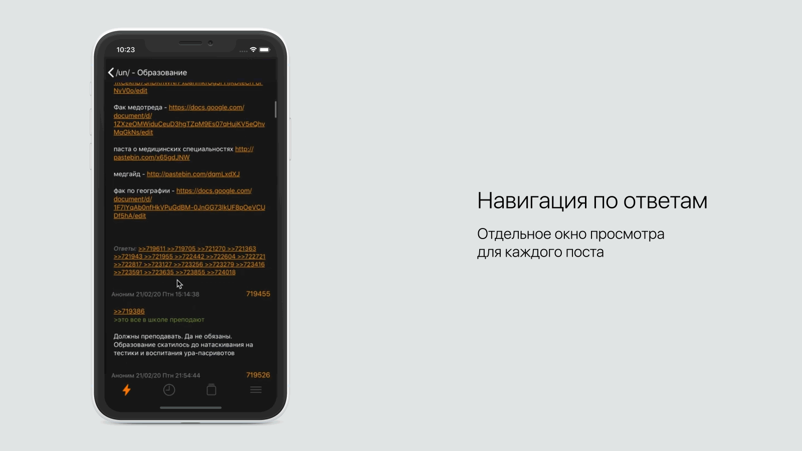
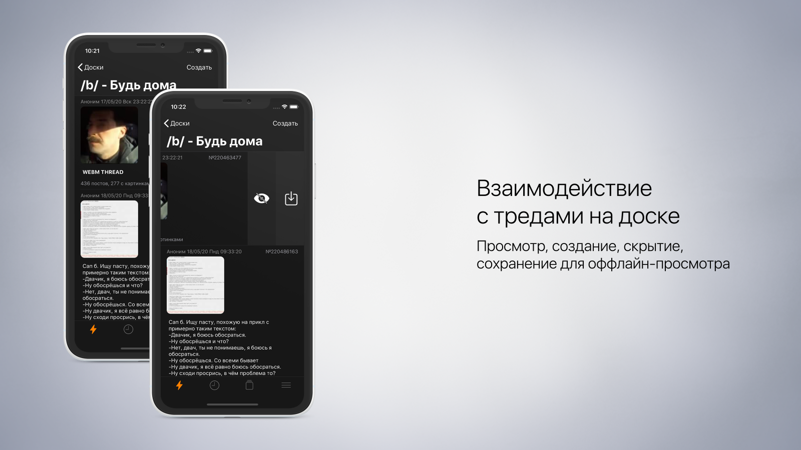
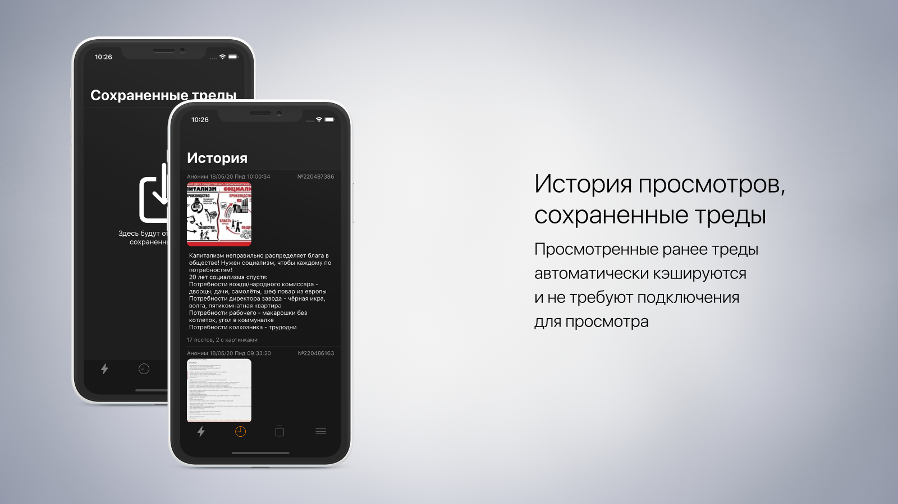
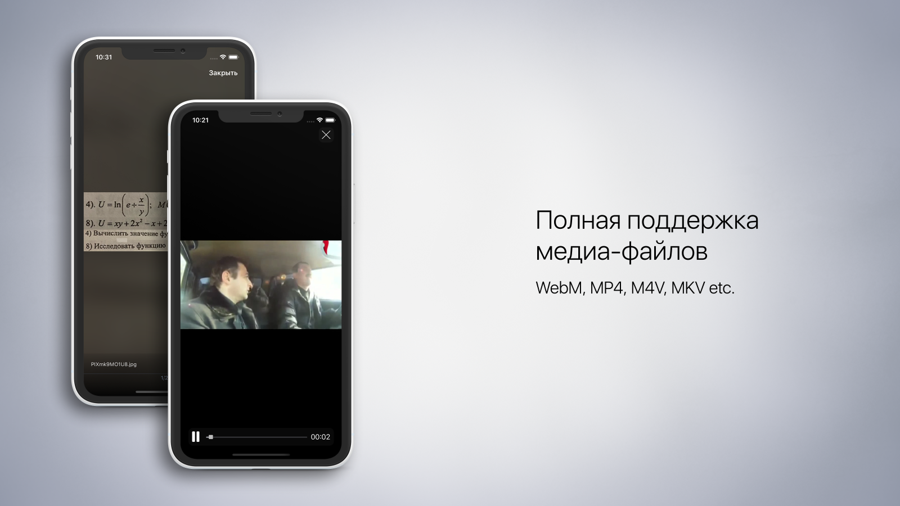
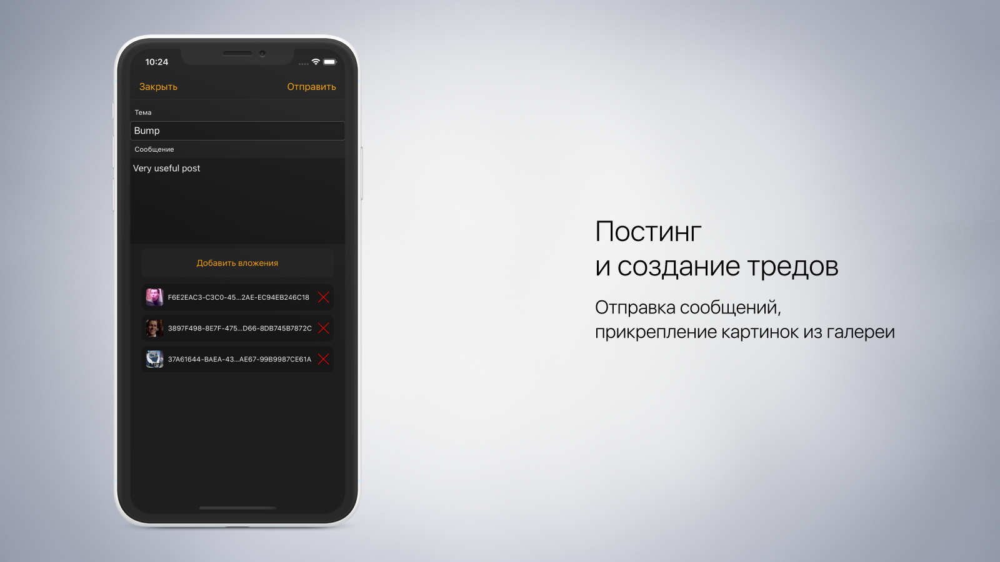

# iChan
iChan - iOS-клиент для имиджборда 2ch.hk, призванный упростить использование ресурса с мобильного устройства, а по совместительству -
моя курсовая работа.

# Функционал
* **Доски**: клиент автоматически получает список доступных досок и группирует их по тематикам. Есть возможность добавлять доски в 
избранное для более удобного доступа.
* **Треды**: создание, просмотр, скрытие, сохранение для оффлайн-просмотра. Внешние ссылки в тредах открываются в Safari, внутренние ссылки, ведущие
на другие треды или посты, обрабатываются самим приложением.
* **Посты**: приложение реализует постинг с помощью Google [in]visible reCaptcha. При создании треда или отправке сообщения может появиться
окно ввода капчи, если это необходимо, однако чаще всего она не требуется. При возникновении какой-либо ошибки постинга появляется
соответствующее уведомление. Реализовано добавление к посту картинок из галереи.
* **Медиа**: приложение поддерживает все типы медиафайлов, которые могут встретиться на ресурсе. При нажатии на любую картинку происходит
ее открытие на полный экран, появляется возможность приблизить изображение, а также переходить на соседние изображения по свайпу 
(в случае, если пост содержит более одной картинки). Реализована поддержка видео в форматах WebM, MP4, M4V, MKV и других.
* **Кэширование**: при открытии каждого треда происходит его сохранение в локальный кэш устройства, чтобы ускорить повторную загрузку
и сделать его доступным при отсутствии подключения. Кэш автоматически очищается, если память устройства на исходе или приложение было
свёрнуто. Просмотреть кэшированные треды в порядке их добавления можно на экране `История`
* **Сохранение тредов**: любой тред можно сохранить для дальнейшего оффлайн-просмотра. По умолчанию сохраняются лишь посты и ссылки на
медиафайлы. В случае такого сохранения, картинки и видео перестанут быть доступны после того, как тред утонет. Для сохранения треда вместе
со всеми медиафайлами нужно воспользоваться пунктом меню "Настройки сохранения" на экране настроек. Доступные режимы сохранения -
`Только текст`, `Текст и изображения`, `Все вложения`. При выборе двух последних вариантов сохранение файлов происходит в `Документы`.

Некоторые функции приложения демонстрируются ниже

# Навигация по ответам на пост

# Просмотр списка тредов

# Кэшированные и сохраненные треды

# Просмотр медиа

# Постинг

# Установка
*Coming soon...*
